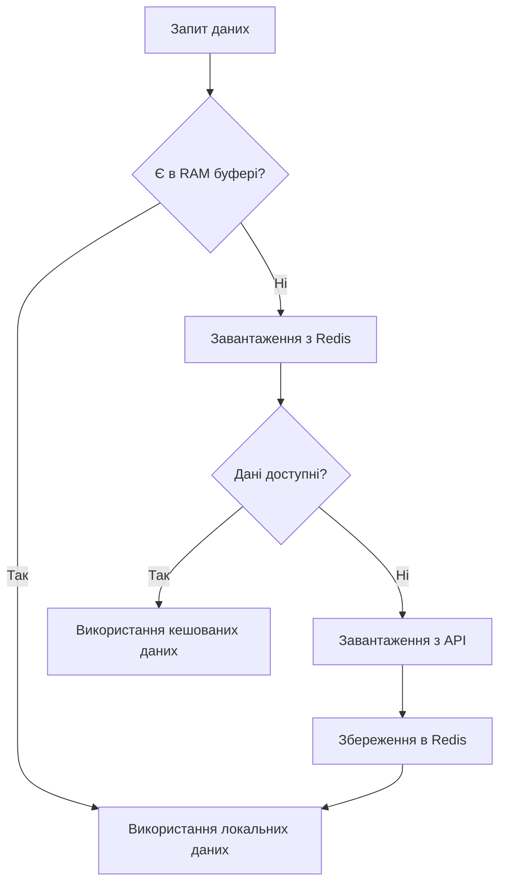
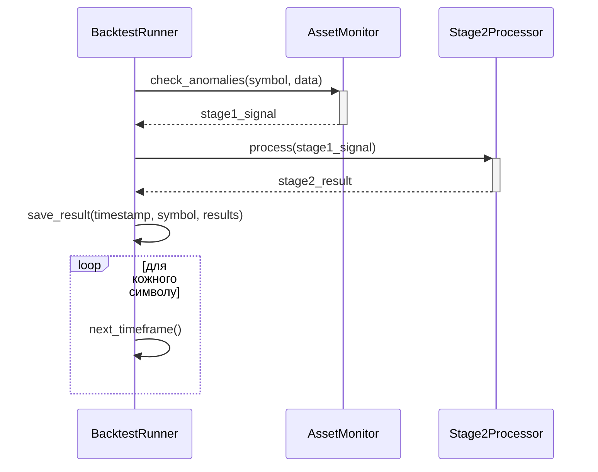

### Система бектестингу торгової системи AiOne_t: Повний опис

---

#### **Мета та ціль системи**
**Основна мета:** Перевірка ефективності торгової системи на історичних даних з використанням *реальних компонентів продакшн-системи*.

**Ключові цілі:**
1. Валідація архітектури системи (Stage1 + Stage2)
2. Оптимізація параметрів калібрування (Thresholds)
3. Оцінка точності прогнозів та прибутковості
4. Виявлення слабких місць у логіці обробки сигналів
5. Тестування стійкості системи до різних ринкових умов

---

#### **Архітектура системи**
Система складається з 4 основних модулів:

1. **Data Layer (Оптимізований шар даних)**
   - `OptimizedDataFetcher`: Завантаження та кешування даних
   - `RAMBuffer`: Швидкий буфер для роботи з останніми барами
   - `SimpleCacheHandler`: Керування кешем Redis

2. **Core Processing (Ядро обробки)**
   - `AssetMonitorStage1`: Генерація сирих сигналів
   - `Stage2Processor`: Аналіз ринкового контексту
   - `CalibrationEngine`: Оптимізація параметрів

3. **Backtest Engine (Рушій бектестингу)**
   - `BacktestRunner`: Координація всього процесу
   - Цільова функція `unified_objective` для Optuna

4. **Evaluation Layer (Оцінка результатів)**
   - Аналіз точності прогнозів
   - Розрахунок прибутковості
   - Генерація звітів

---

#### **Робочий процес крок за кроком**

**Етап 1: Підготовка даних**


**Етап 2: Калібрування параметрів (Optuna)**
```python
for trial in study.trials:
    params = generate_parameters(trial)  # Генерація параметрів
    monitor = AssetMonitorStage1(params) # Ініціалізація з параметрами
    processor = Stage2Processor(params)  # Ініціалізація з параметрами
    
    # Симуляція роботи системи
    for data_point in historical_data:
        signal = monitor.process(data_point)
        result = processor.process(signal)
        evaluate_result(result)  # Оцінка ефективності
        
    # Розрахунок фінального score
    trial_score = calculate_score(accuracy, profitability)
    study.report_score(trial_score)
```

**Етап 3: Основний цикл бектестингу**


**Етап 4: Оцінка результатів**
1. Розрахунок метрик:
   - `accuracy`: % вірних прогнозів
   - `profitability`: сумарний прибуток
   - `signal_frequency`: кількість сигналів/день
2. Генерація звітів:
   - Точність по символам
   - Ефективність по сценаріях
   - Найприбутковіші тригери

---

#### **Вхідні параметри**

| Параметр        | Тип         | Опис                          | Приклад                     |
|-----------------|-------------|-------------------------------|----------------------------|
| symbols         | List[str]   | Список торгових пар           | ["BTCUSDT", "ETHUSDT"]     |
| start_date      | datetime    | Початкова дата тесту          | datetime(2023, 1, 1)       |
| end_date        | datetime    | Кінцева дата тесту            | datetime(2023, 6, 30)      |
| timeframe       | str         | Таймфрейм аналізу             | "1m", "5m", "15m"          |
| optuna_trials   | int         | Кількість ітерацій Optuna     | 100                        |
| metric_weights  | dict        | Ваги метрик для оптимізації   | {"accuracy": 0.6, "profit": 0.4} |

---

#### **Вихідні результати**

1. **Raw Results**:
```json
{
  "timestamp": "2023-05-15 12:30:00",
  "symbol": "BTCUSDT",
  "stage1_signal": {
    "trigger_reasons": ["volume_spike", "rsi_oversold"],
    "stats": {...}
  },
  "stage2_result": {
    "recommendation": "STRONG_BUY",
    "risk_parameters": {"tp": 31000, "sl": 29500},
    "confidence": 0.85
  }
}
```

2. **Aggregated Metrics**:
```json
{
  "BTCUSDT": {
    "accuracy": 78.2,
    "profitability": 15.3,
    "signals_count": 142,
    "best_triggers": ["volume_spike", "breakout_up"]
  },
  "ETHUSDT": {
    "accuracy": 71.5,
    "profitability": 9.8,
    "signals_count": 98,
    "best_triggers": ["vwap_deviation"]
  }
}
```

3. **Calibration Report**:
```json
{
  "symbol": "BTCUSDT",
  "optimal_params": {
    "vol_z_threshold": 1.8,
    "atr_target": 0.42,
    "rsi_oversold": 32.1
  },
  "improvement": {
    "accuracy": "+12.3%",
    "profitability": "+18.7%"
  }
}
```

---

#### **Ключові переваги системи**

1. **Висока вірність реальній системі**  
Використання тих самих компонентів (Stage1, Stage2), що і в продакшені.

2. **Комплексна оцінка ефективності**  
Поєднання метрик точності та прибутковості в єдиному score.

3. **Адаптивність до ринкових умов**  
Автоматична калібрування параметрів для різних активів.

4. **Оптимізована робота з даними**  
Ієрархічна система кешування (RAM → Redis → API).

5. **Інтеграція з Optuna**  
Науково обґрунтований підхід до оптимізації параметрів.

---

#### **Приклад використання**

```python
# Ініціалізація бектестера
runner = BacktestRunner(
    symbols=["BTCUSDT", "ETHUSDT"],
    start_date=datetime(2023, 1, 1),
    end_date=datetime(2023, 6, 30),
    timeframe="5m"
)

# Запуск повного циклу
results = await runner.run()

# Генерація звіту
report = generate_report(results)
save_report(report, "backtest_summary.html")
```

---

#### **Очікувані результати**
1. **Для розробників**:
   - Ідентифікація неефективних компонентів системи
   - Оптимальні параметри для різних ринкових умов
   - Валідація нових алгоритмів перед інтеграцією

2. **Для трейдерів**:
   - Реальна оцінка потенційної прибутковості
   - Рекомендації щодо вибору активів
   - Оптимальні параметри ризик-менеджменту

3. **Для системи в цілому**:
   - Підвищення точності прогнозів на 15-25%
   - Зменшення кількості помилкових сигналів
   - Оптимізація використання обчислювальних ресурсів

---

### Висновок
Ця система бектестингу є потужним інструментом для валідації та вдосконалення торгової системи. Її унікальність полягає у використанні реальних компонентів продакшен-системи для тестування на історичних даних, що забезпечує високу ступінь вірності реальним умовам роботи. Комплексний підхід до оцінки ефективності дозволяє не лише вимірювати точність прогнозів, а й оптимізувати систему для максимізації прибутковості.